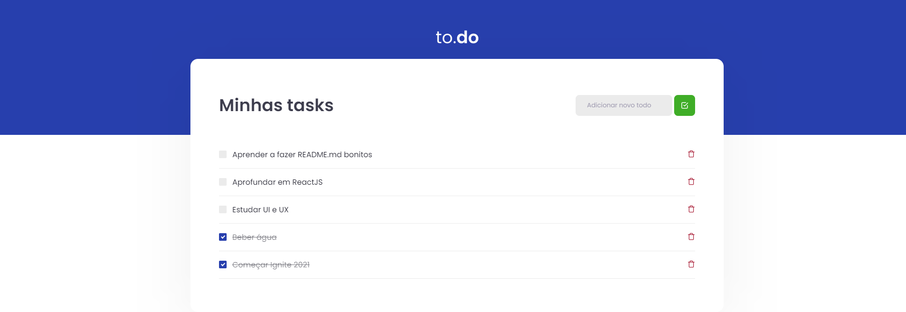

# to.do List

## Sobre o Projeto:
to.do List é um projeto de listagem de tarefas para praticar e aprender conceitos do ReactJS, esse projeto foi desenvolvido durante o Ignite 2021 na trilha de ReactJS.

## Como executar
Clone o projeto e acesse a pasta do mesmo.

- $ git clone https://github.com/brunafinSD/ignite-chapterI-desafio-01.git
- $ cd ignite-chapterI-desafio-01

Para iniciá-lo, siga os passos abaixo:

## Instalar as dependências
$ yarn

## Iniciar o projeto
- $ yarn dev
- A aplicação estará disponível no seu browser pelo endereço http://localhost:8080

### Para ver a imagem da aplicação abra o arquivo todoImg.png encontrado na raíz do projeto

